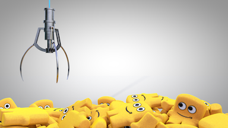

<!DOCTYPE html>
<html lang="en">
<head>
<meta charset = "UTF-8">
<title> PECCI<3 </title>

</head>
<body>
	

		<h1>PECCI</h1>
		 
		

		 
		
		
PECCI

		
		

			<button onclick="gallery(0)">Prev</button>
			<button onclick="gallery(1)">Next</button>
		

		 
		

		 
		
<button onclick="colorBg()">Change Color

	

</body>
</html>
